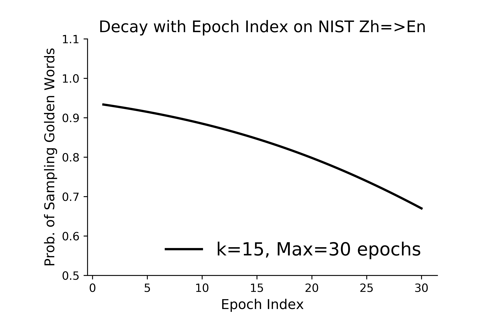
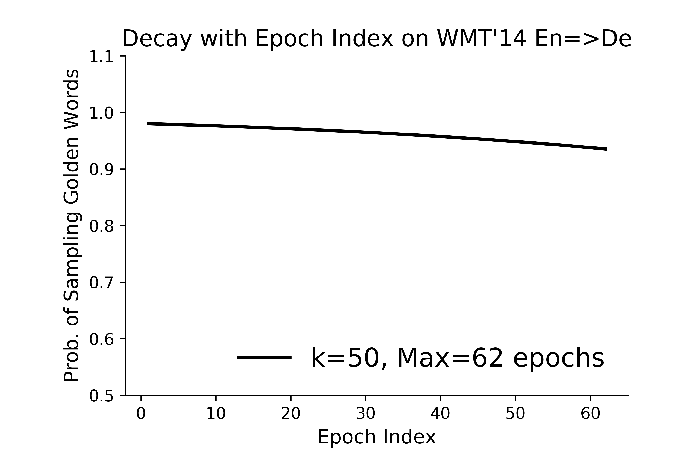
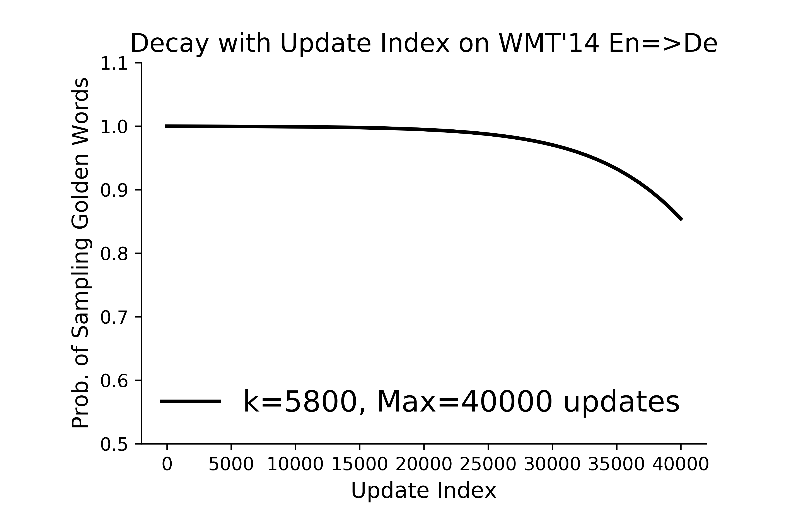

# OR-NMT: Bridging the Gap between Training and Inference for Neural Machine Translation

> Wen Zhang, Yang Feng, Fandong Meng, Di You and Qun Liu. Bridging the Gap between Training and Inference for Neural Machine Translation. In Proceedings of ACL, 2019. [\[paper\]](https://www.aclweb.org/anthology/P19-1426.pdf)[\[code\]](https://github.com/ictnlp/OR-NMT)

Codes in the two directories are the OR-NMT systems based on the RNNsearch and Transformer models correspondingly
+ OR-RNNsearch: based on the RNNsearch system which we implemented from scratch
+ OR-Transformer: based on the Transformer system [fairseq](https://github.com/pytorch/fairseq) implemented by Facebook

## Runtime Environment
This system has been tested in the following environment.
+ OS: Ubuntu 16.04.1 LTS 64 bits
+ Python version \>=3.6
+ Pytorch version \>=1.2

For OR-Transformer:

First, go into the OR-Transformer directory.

Then, the training script is the same with fairseq, except for the following arguments:
- add `--use-word-level-oracles` for training Transformer by word-level oracle.
- add `--use-sentence-level-oracles` for training Transformer by sentence-level oracle.

By default, the probability is decayed based on the update index.
- add `--use-epoch-numbers-decay` for decaying based on the epoch index.
- the hyperparameter `--decay-k` is used to control the speed of the inverse sigmoid decay, which is  in Eq.(15) in the paper.
  - set `8~15` for the decaying based on epoch index
  - set `3000~8000` for the decaying based on update index
  - The larger the value, the slower the decay, vice versa.

>> **NOTE:** **For a new data set, the hyperparameter `--decay-k` needs to be manually adjusted according to the maximum number of training updates (`default`) or epochs (`--use-epoch-numbers-decay`) to ensure that the probability of sampling golden words does not decay so quickly.**

>> For Eq.(11~13) in the paper,  is actually the same as . The  operation is not needed in the code implementation.

Gumbel noise:
- add `--use-greed-gumbel-noise` to sample word-level oracle with Gumbel noise
- add `--use-bleu-gumbel-noise` to sample sentence-level oracle with Gumbel noise
- `--gumbel-noise` is used as the hyper-parameter in the calculation of Gumbel noise
- `--oracle-search-beam-size` is used to set the beam size in length-constrained decoding

As for the `--arch` and `--criterion` arguments, `oracle_` should be used as the prefix for OR-NMT training, such as:
- `--arch transformer_vaswani_wmt_en_de_big` -> `--arch oracle_transformer_vaswani_wmt_en_de_big`
- `--criterion label_smoothed_cross_entropy` -> `--criterion oracle_label_smoothed_cross_entropy`

Example of the script for word-level training and decaying the probability based on epoch index:
```shell
export CUDA_VISIBLE_DEVICES=0,1,2,3
batch_size=4096
accum=2
data_dir=directory_of_data_bin
model_dir=./ckpt
python train.py $data_dir \
    --arch oracle_transformer_vaswani_wmt_en_de_big --share-all-embeddings \
    --optimizer adam --adam-betas '(0.9, 0.98)' --clip-norm 0.0 --lr-scheduler inverse_sqrt \
    --warmup-init-lr 1e-07 --warmup-updates 4000 --lr 0.0005 --min-lr 1e-09 \
    --weight-decay 0.0 --criterion oracle_label_smoothed_cross_entropy --label-smoothing 0.1 \
    --max-tokens $batch_size --update-freq $accum --no-progress-bar --log-format json --max-update 200000 \
    --log-interval 10 --save-interval-updates 10000 --keep-interval-updates 10 --save-interval 10000 \
    --seed 1111 --skip-invalid-size-inputs-valid-test \
    --distributed-port 28888 --distributed-world-size 4 --ddp-backend=no_c10d \
    --source-lang en --target-lang de --save-dir $model_dir \
    --use-word-level-oracles --use-epoch-numbers-decay --decay-k 10 \
    --use-greed-gumbel-noise --gumbel-noise 0.5 | tee -a $model_dir/training.log
```


### Model settings on NIST Chinese-\>English (Zh-\>En) and WMT'14 English-\>German (En-\>De).

| Models | Translation Task | \#GPUs | \#Toks. | \#Freq. | Max
| --- | --- | --- | --- | --- | ---
| Transformer-big | <div style="width: 150pt">NIST Zh-\>En | 8 | 4096 | 3 | 30 epochs
| +Word-level Oracle| <div style="width: 150pt">NIST Zh-\>En | 8 | 4096 | 3 | 30 epochs
| Transformer-base | <div style="width: 150pt">WMT'14 En-\>De | 8 | 6144 | 2 | 80000 updates (62 epochs)
| +Word-level Oracle | <div style="width: 150pt">WMT'14 En-\>De | 8 | 12288 | 1 | 80000 updates (62 epochs)
| +Sentence-level Oracle | <div style="width: 150pt">WMT'14 En-\>De | 8 | 12288 | 1 | 40000 updates (62th epoch -> 93th epoch)

> **\#Toks.** means batchsize on single GPU.
> 
> **\#Freq.** means the times of gradient accumulation.
> 
> **Max** represents the maximum number of training epochs (30) or updates (80k).

### Results and Settings on NIST Chinese-\>English translation task
We calculate the case-insensitive 4-gram tokenized BLEU by script [*multibleu.perl*](https://github.com/moses-smt/mosesdecoder/blob/RELEASE-4.0/scripts/generic/multi-bleu.perl)

| Models | Dev. (MT02) | MT03 | MT04 | MT05 | MT06 | MT08 | Average
| ----- | ----- | ----- | ----- | ----- | ----- | ----- | -----  
| Transformer-big | 48.50 |	47.29 | 47.79 | 48.28 | 47.50 | 38.50 | 45.87 |	30
| +Word-level Oracle (==10) | 49.18 | 48.70 | 48.67 | 48.69 | 48.49 | 39.58 | 46.83 | 30
| +Word-level Oracle (**==15**) | **49.05** | **48.57** | **48.73** | **48.68** | **48.59** | **39.68** | **46.85** | 30
| +Word-level Oracle (==20) | 49.30 | 48.46 | 48.57 | 48.87 | 48.57 | 39.46 | 46.79 | 30
| +Word-level Oracle (==25) | 48.88 | 48.32 | 48.66 | 48.74 | 48.32 | 39.38 | 46.68 | 30
| +Word-level Oracle (==30) | 48.47 | 48.37 | 48.50 | 48.63 | 48.07 | 39.54 | 46.62 | 46.74 | 30


We also evaluate by the case-insensitive 4-gram detokenized BLEU with SacreBLEU, which is calculated the script [score.py](https://github.com/pytorch/fairseq/blob/master/fairseq_cli/score.py) provided by fairseq:
**BLEU+case.mixed+lang.en-\{de,fr\}+numrefs.4+smooth.exp+tok.13a+version.1.4.4**

| Models | Dev. (MT02) | MT03 | MT04 | MT05 | MT06 | MT08 | Average
| ----- | ----- | ----- | ----- | ----- | ----- | ----- | -----
| Transformer-big | 48.46 | 47.41 | 47.88 | 48.25 | 47.52 | 38.60 | 45.93 | 30
| +Word-level Oracle (==10) | 49.20	| 48.80 | 48.77 | 48.64 | 48.49 | 39.79 | 46.90 | 30
| +Word-level Oracle (**==15**) | **49.07** | **48.64** | **48.81** | **48.63** | **48.65** | **39.88** | **46.92** | 30
| +Word-level Oracle (==20) | 49.32	| 48.54 | 48.73 | 48.82 | 48.51 | 39.50 | 46.82 | 30
| +Word-level Oracle (==25) | 48.90	| 48.18 | 48.70 | 48.59 | 47.73 | 39.14 | 46.47 | 30
| +Word-level Oracle (==30) | 48.53	| 48.59 | 48.74 | 48.58 | 48.07 | 39.71 | 46.74 | 30

The setting of the NIST Chinese-\>English:
```shell
export CUDA_VISIBLE_DEVICES=0,1,2,3,4,5,6,7
data_bin_dir=directory_of_data_bin
model_dir=./ckpt
python train.py $data_bin_dir \
    --arch oracle_transformer_vaswani_wmt_en_de_big --share-all-embeddings \
    --optimizer adam --adam-betas '(0.9, 0.98)' --clip-norm 0.0 --lr-scheduler inverse_sqrt \
    --warmup-init-lr 1e-07 --warmup-updates 4000 --lr 0.0007 --min-lr 1e-09 \
    --weight-decay 0.0 --criterion oracle_label_smoothed_cross_entropy --label-smoothing 0.1 \
    --max-tokens 4096 --update-freq 3 --no-progress-bar --log-format json --max-epoch 30 \
    --log-interval 10 --save-interval 2 --keep-last-epochs 10 \
    --seed 1111 --use-epoch-numbers-decay \
    --use-word-level-oracles --decay-k 15 --use-greed-gumbel-noise --gumbel-noise 0.5 \
    --distributed-port 32222 --distributed-world-size 8 --ddp-backend=no_c10d \
    --source-lang zh --target-lang en --save-dir $model_dir | tee -a $model_dir/training.log
```

As Eq.(15) in the paper, the probability of sampling golden words decays with the number of epochs as follows: 

<div align="center">

</div>


### Results and Settings on WMT'14 English-\>German translation task
We calculate the case-sensitive 4-gram tokenized BLEU by script [*multibleu.perl*](https://github.com/moses-smt/mosesdecoder/blob/RELEASE-4.0/scripts/generic/multi-bleu.perl)

| Models | newstest2014 | \#update
| ----- | ----- | -----
| Transformer-base | 27.54 | 80000
| +Word-level Oracle (==50, ==0.8) | 28.01 | 80000
| +Sentence-level Oracle (==5800, ==0.5, beam\_size==4) | 28.45 | 40000

We also evaluate by the case-sensitive 4-gram detokenized BLEU with SacreBLEU, which is calculated the script [score.py](https://github.com/pytorch/fairseq/blob/master/fairseq_cli/score.py) provided by fairseq:
**BLEU+case.mixed+lang.en-\{de,fr\}+numrefs.1+smooth.exp+tok.13a+version.1.4.4**

| Models | newstest2014 | \#update
| ----- | ----- | -----
| Transformer-base | 26.45 | 80000
| +Word-level Oracle (==50, ==0.8) | 26.86 | 80000
| +Sentence-level Oracle (==5800, ==0.5, beam\_size==4) | 27.24 | 40000

Setting of the word-level oracle for the WMT'14 English-\>German dataset:

```shell
export CUDA_VISIBLE_DEVICES=0,1,2,3,4,5,6,7
data_bin_dir=directory_of_data_bin
model_dir=./ckpt
python train.py $data_bin_dir \
    --arch oracle_transformer_wmt_en_de --share-all-embeddings \
    --optimizer adam --adam-betas '(0.9, 0.98)' --clip-norm 0.0 --lr-scheduler inverse_sqrt \
    --warmup-init-lr 1e-07 --warmup-updates 4000 --lr 0.0007 --min-lr 1e-09 \
    --weight-decay 0.0 --criterion oracle_label_smoothed_cross_entropy --label-smoothing 0.1 \
    --max-tokens 12288 --update-freq 1 --no-progress-bar --log-format json --max-update 80000 \
    --log-interval 10 --save-interval-updates 4000 --keep-interval-updates 10 --save-interval 10000 \
    --seed 1111 --use-epoch-numbers-decay \
    --use-word-level-oracles --decay-k 50 --use-greed-gumbel-noise --gumbel-noise 0.8 \
    --distributed-port 31111 --distributed-world-size 8 --ddp-backend=no_c10d \
    --source-lang en --target-lang de --save-dir $model_dir | tee -a $model_dir/training.log
```

As Eq.(15) in the paper, the probability of sampling golden words decays with the number of epochs as follows: 

<div align="center">

</div>


In order to save training time, we use the sentence-level oracle method to finetune the best base model.

Setting of the sentence-level oracle for the WMT'14 English-\>German dataset:

```shell
export CUDA_VISIBLE_DEVICES=0,1,2,3,4,5,6,7
data_bin_dir=directory_of_data_bin
model_dir=./ckpt
python train.py $data_bin_dir \
    --arch oracle_transformer_wmt_en_de --share-all-embeddings \
    --optimizer adam --adam-betas '(0.9, 0.98)' --clip-norm 0.0 --lr-scheduler inverse_sqrt \                                                                                                                
    --warmup-init-lr 1e-07 --warmup-updates 4000 --lr 0.0007 --min-lr 1e-09 \
    --weight-decay 0.0 --criterion oracle_label_smoothed_cross_entropy --label-smoothing 0.1 \
    --max-tokens 12288 --update-freq 1 --no-progress-bar --log-format json --max-update 40000 \
    --log-interval 10 --save-interval-updates 2000 --keep-interval-updates 10 --save-interval 10000 \
    --seed 1111 --reset-optimizer --reset-meters \
    --use-sentence-level-oracles --decay-k 5800 --use-bleu-gumbel-noise --gumbel-noise 0.5 --oracle-search-beam-size 4 \ 
    --distributed-port 31111 --distributed-world-size 8 --ddp-backend=no_c10d \
    --source-lang en --target-lang de --save-dir $model_dir | tee -a $model_dir/training.log
```

As Eq.(15) in the paper, the probability of sampling golden words decays with the number of udpates as follows: 

<div align="center">

</div>


## NOTE
+ The speed of word-level training is almost the same as original transformer.
+ Sentence-level training is slower than word-level training.
+ `--use-epoch-numbers-decay` and `--decay-k` need to be adapted on different training data.
+ The `prob` field in the training log means the decay probability of sampling golden words.

Test training speed and GPU memory usage on iwslt de2en training set

| Model Name | Memory Usage (G) | Training Speed (upd/s) 
| ----- | ----- | -----
| Transformer  | 4.39  | 2.65 
| Word-level training | 4.57 | 2.25 
| Sentence-level training (decay\_prob=1, beam\_size=4) | 4.75 | 0.59

## Citation
please cite as:
```bibtex
@inproceedings{zhang2019bridging,
    title = "Bridging the Gap between Training and Inference for Neural Machine Translation",
    author = "Zhang, Wen and Feng, Yang and Meng, Fandong and You, Di and Liu, Qun",
    booktitle = "Proceedings of the 57th Annual Meeting of the Association for Computational Linguistics",
    month = jul,
    year = "2019",
    address = "Florence, Italy",
    publisher = "Association for Computational Linguistics",
    url = "https://www.aclweb.org/anthology/P19-1426",
    doi = "10.18653/v1/P19-1426",
    pages = "4334--4343",
}
```

<p align="center">
  
  <br />
  <br />
  <a href="https://github.com/pytorch/fairseq/blob/master/LICENSE"></a>
  <a href="https://github.com/pytorch/fairseq/releases"></a>
  <a href="https://github.com/pytorch/fairseq/actions?query=workflow:build"></a>
  <a href="https://fairseq.readthedocs.io/en/latest/?badge=latest"></a>
</p>

--------------------------------------------------------------------------------

Fairseq(-py) is a sequence modeling toolkit that allows researchers and
developers to train custom models for translation, summarization, language
modeling and other text generation tasks.

### What's New:

- March 2020: [Byte-level BPE code released](examples/byte_level_bpe/README.md)
- February 2020: [mBART model and code released](examples/mbart/README.md)
- February 2020: [Added tutorial for back-translation](https://github.com/pytorch/fairseq/tree/master/examples/backtranslation#training-your-own-model-wmt18-english-german)
- December 2019: [fairseq 0.9.0 released](https://github.com/pytorch/fairseq/releases/tag/v0.9.0)
- November 2019: [VizSeq released (a visual analysis toolkit for evaluating fairseq models)](https://facebookresearch.github.io/vizseq/docs/getting_started/fairseq_example)
- November 2019: [CamemBERT model and code released](examples/camembert/README.md)
- November 2019: [BART model and code released](examples/bart/README.md)
- November 2019: [XLM-R models and code released](examples/xlmr/README.md)
- September 2019: [Nonautoregressive translation code released](examples/nonautoregressive_translation/README.md)
- August 2019: [WMT'19 models released](examples/wmt19/README.md)
- July 2019: fairseq relicensed under MIT license
- July 2019: [RoBERTa models and code released](examples/roberta/README.md)
- June 2019: [wav2vec models and code released](examples/wav2vec/README.md)

### Features:

Fairseq provides reference implementations of various sequence-to-sequence models, including:
- **Convolutional Neural Networks (CNN)**
  - [Language Modeling with Gated Convolutional Networks (Dauphin et al., 2017)](examples/language_model/conv_lm/README.md)
  - [Convolutional Sequence to Sequence Learning (Gehring et al., 2017)](examples/conv_seq2seq/README.md)
  - [Classical Structured Prediction Losses for Sequence to Sequence Learning (Edunov et al., 2018)](https://github.com/pytorch/fairseq/tree/classic_seqlevel)
  - [Hierarchical Neural Story Generation (Fan et al., 2018)](examples/stories/README.md)
  - [wav2vec: Unsupervised Pre-training for Speech Recognition (Schneider et al., 2019)](examples/wav2vec/README.md)
- **LightConv and DynamicConv models**
  - [Pay Less Attention with Lightweight and Dynamic Convolutions (Wu et al., 2019)](examples/pay_less_attention_paper/README.md)
- **Long Short-Term Memory (LSTM) networks**
  - Effective Approaches to Attention-based Neural Machine Translation (Luong et al., 2015)
- **Transformer (self-attention) networks**
  - Attention Is All You Need (Vaswani et al., 2017)
  - [Scaling Neural Machine Translation (Ott et al., 2018)](examples/scaling_nmt/README.md)
  - [Understanding Back-Translation at Scale (Edunov et al., 2018)](examples/backtranslation/README.md)
  - [Adaptive Input Representations for Neural Language Modeling (Baevski and Auli, 2018)](examples/language_model/transformer_lm/README.md)
  - [Mixture Models for Diverse Machine Translation: Tricks of the Trade (Shen et al., 2019)](examples/translation_moe/README.md)
  - [RoBERTa: A Robustly Optimized BERT Pretraining Approach (Liu et al., 2019)](examples/roberta/README.md)
  - [Facebook FAIR's WMT19 News Translation Task Submission (Ng et al., 2019)](examples/wmt19/README.md)
  - [Jointly Learning to Align and Translate with Transformer Models (Garg et al., 2019)](examples/joint_alignment_translation/README.md )
  - [Multilingual Denoising Pre-training for Neural Machine Translation (Liu et at., 2020)](examples/mbart/README.md)
  - [Neural Machine Translation with Byte-Level Subwords (Wang et al., 2020)](examples/byte_level_bpe/README.md)
- **Non-autoregressive Transformers**
  - Non-Autoregressive Neural Machine Translation (Gu et al., 2017)
  - Deterministic Non-Autoregressive Neural Sequence Modeling by Iterative Refinement (Lee et al. 2018)
  - Insertion Transformer: Flexible Sequence Generation via Insertion Operations (Stern et al. 2019)
  - Mask-Predict: Parallel Decoding of Conditional Masked Language Models (Ghazvininejad et al., 2019)
  - [Levenshtein Transformer (Gu et al., 2019)](examples/nonautoregressive_translation/README.md)


**Additionally:**
- multi-GPU (distributed) training on one machine or across multiple machines
- fast generation on both CPU and GPU with multiple search algorithms implemented:
  - beam search
  - Diverse Beam Search ([Vijayakumar et al., 2016](https://arxiv.org/abs/1610.02424))
  - sampling (unconstrained, top-k and top-p/nucleus)
- large mini-batch training even on a single GPU via delayed updates
- mixed precision training (trains faster with less GPU memory on [NVIDIA tensor cores](https://developer.nvidia.com/tensor-cores))
- extensible: easily register new models, criterions, tasks, optimizers and learning rate schedulers

We also provide [pre-trained models for translation and language modeling](#pre-trained-models-and-examples)
with a convenient `torch.hub` interface:
```python
en2de = torch.hub.load('pytorch/fairseq', 'transformer.wmt19.en-de.single_model')
en2de.translate('Hello world', beam=5)
# 'Hallo Welt'
```
See the PyTorch Hub tutorials for [translation](https://pytorch.org/hub/pytorch_fairseq_translation/)
and [RoBERTa](https://pytorch.org/hub/pytorch_fairseq_roberta/) for more examples.


# Requirements and Installation

* [PyTorch](http://pytorch.org/) version >= 1.4.0
* Python version >= 3.6
* For training new models, you'll also need an NVIDIA GPU and [NCCL](https://github.com/NVIDIA/nccl)
* **For faster training** install NVIDIA's [apex](https://github.com/NVIDIA/apex) library with the `--cuda_ext` and `--deprecated_fused_adam` options

To install fairseq:
```bash
pip install fairseq
```

On MacOS:
```bash
CFLAGS="-stdlib=libc++" pip install fairseq
```

If you use Docker make sure to increase the shared memory size either with
`--ipc=host` or `--shm-size` as command line options to `nvidia-docker run`.

**Installing from source**

To install fairseq from source and develop locally:
```bash
git clone https://github.com/pytorch/fairseq
cd fairseq
pip install --editable .
```

# Getting Started

The [full documentation](https://fairseq.readthedocs.io/) contains instructions
for getting started, training new models and extending fairseq with new model
types and tasks.

# Pre-trained models and examples

We provide pre-trained models and pre-processed, binarized test sets for several tasks listed below,
as well as example training and evaluation commands.

- [Translation](examples/translation/README.md): convolutional and transformer models are available
- [Language Modeling](examples/language_model/README.md): convolutional and transformer models are available
- [wav2vec](examples/wav2vec/README.md): wav2vec large model is available

We also have more detailed READMEs to reproduce results from specific papers:
- [Neural Machine Translation with Byte-Level Subwords (Wang et al., 2020)](examples/byte_level_bpe/README.md)
- [Jointly Learning to Align and Translate with Transformer Models (Garg et al., 2019)](examples/joint_alignment_translation/README.md )
- [Levenshtein Transformer (Gu et al., 2019)](examples/nonautoregressive_translation/README.md)
- [Facebook FAIR's WMT19 News Translation Task Submission (Ng et al., 2019)](examples/wmt19/README.md)
- [RoBERTa: A Robustly Optimized BERT Pretraining Approach (Liu et al., 2019)](examples/roberta/README.md)
- [wav2vec: Unsupervised Pre-training for Speech Recognition (Schneider et al., 2019)](examples/wav2vec/README.md)
- [Mixture Models for Diverse Machine Translation: Tricks of the Trade (Shen et al., 2019)](examples/translation_moe/README.md)
- [Pay Less Attention with Lightweight and Dynamic Convolutions (Wu et al., 2019)](examples/pay_less_attention_paper/README.md)
- [Understanding Back-Translation at Scale (Edunov et al., 2018)](examples/backtranslation/README.md)
- [Classical Structured Prediction Losses for Sequence to Sequence Learning (Edunov et al., 2018)](https://github.com/pytorch/fairseq/tree/classic_seqlevel)
- [Hierarchical Neural Story Generation (Fan et al., 2018)](examples/stories/README.md)
- [Scaling Neural Machine Translation (Ott et al., 2018)](examples/scaling_nmt/README.md)
- [Convolutional Sequence to Sequence Learning (Gehring et al., 2017)](examples/conv_seq2seq/README.md)
- [Language Modeling with Gated Convolutional Networks (Dauphin et al., 2017)](examples/language_model/conv_lm/README.md)

# Join the fairseq community

* Facebook page: https://www.facebook.com/groups/fairseq.users
* Google group: https://groups.google.com/forum/#!forum/fairseq-users

# License
fairseq(-py) is MIT-licensed.
The license applies to the pre-trained models as well.

# Citation

Please cite as:

```bibtex
@inproceedings{ott2019fairseq,
  title = {fairseq: A Fast, Extensible Toolkit for Sequence Modeling},
  author = {Myle Ott and Sergey Edunov and Alexei Baevski and Angela Fan and Sam Gross and Nathan Ng and David Grangier and Michael Auli},
  booktitle = {Proceedings of NAACL-HLT 2019: Demonstrations},
  year = {2019},
}
```
